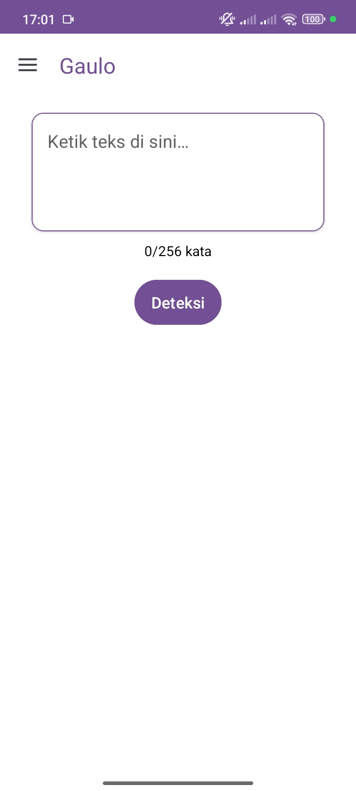
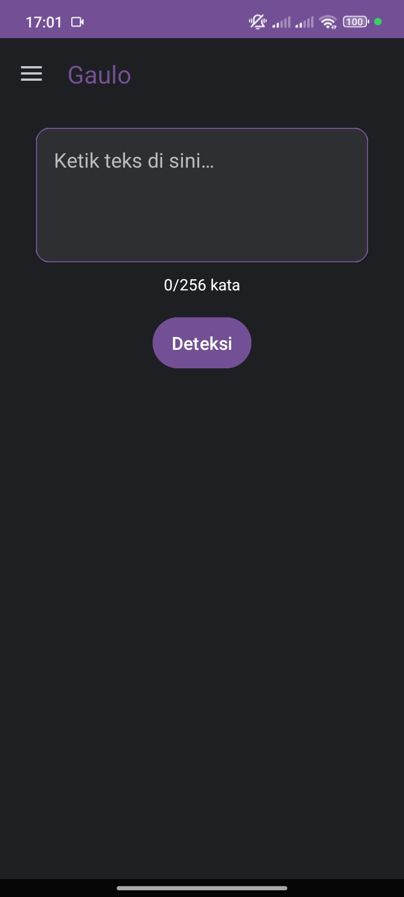
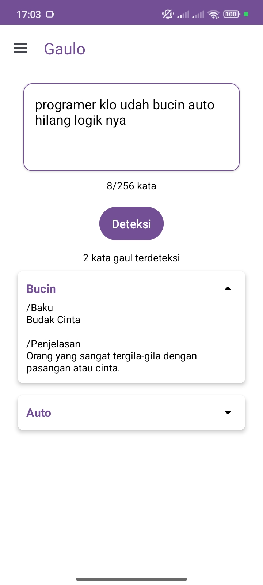

<h1 align="center">✨ Gaulo — Aplikasi Deteksi Kata Gaul Bahasa Indonesia ✨</h1>

  
  
  
  

  

---

## 📖 Latar Belakang

**Gaulo** merupakan aplikasi eksperimental yang dikembangkan untuk mendeteksi **kata-kata gaul atau slang** dalam Bahasa Indonesia.  
Aplikasi ini lahir dari ide penelitian ringan di bidang **Natural Language Processing (NLP)** dengan fokus pada pemrosesan bahasa informal sehari-hari.

Proyek ini dimulai dengan semangat eksplorasi — menggabungkan teknologi berbasis **Kotlin**, **Android Studio**, dan **fuzzy matching**.  
Tujuannya sederhana: menciptakan alat bantu linguistik yang dapat digunakan secara **offline** untuk mengenali kata-kata gaul dalam kalimat atau paragraf.

Selain itu, aplikasi juga dirancang untuk mengumpulkan **feedback otomatis** melalui **Firebase**, yang berfungsi untuk memperkaya data dan menganalisis pola pencarian pengguna terhadap kata gaul tertentu.

---

## 🧩 Fitur Utama

- 🔍 **Deteksi Kata Gaul Offline**  
  Mendeteksi hingga **10 kata gaul** dalam satu paragraf, dengan dukungan input hingga **256 kata**.

- 🌓 **Mode Tampilan Adaptif**  
  Menyediakan **mode Terang**, **Gelap**, dan **Otomatis** untuk kenyamanan pengguna.

- ☁️ **Feedback Otomatis ke Firebase**  
  Setiap input pengguna dikirim ke **Firebase Realtime Database** untuk membantu analisis dan pengembangan data linguistik.

- 🎨 **Antarmuka Minimalis dan Ramah Pengguna**  
  Menggunakan warna utama **Ungu Neon (#6A0DAD)** dan **Pink Neon (#FF007F)** yang menjadi ciri khas **Seulanga Labs**.

---

## 🧠 Teknologi yang Digunakan

| Komponen | Teknologi |
|-----------|------------|
| Bahasa Pemrograman | Kotlin |
| IDE | Android Studio |
| Database Online | Firebase Realtime Database |
| Metode Deteksi | Fuzzy Matching (Levenshtein Distance) |
| Data Lokal | XML Resource Arrays |
| UI Framework | Material Design Components |

---

## 🧾 Riwayat Pengembangan

| Periode | Tahapan |
|----------|----------|
| **Januari 2025** | Konsep dan perancangan awal aplikasi |
| **Februari 2025** | Implementasi algoritma fuzzy matching |
| **Maret–April 2025** | Integrasi Firebase untuk feedback otomatis |
| **Juni 2025** | Optimalisasi tampilan dan performa |
| **Oktober 2025** | Evaluasi akhir dan penutupan proyek |

---

## 📸 Preview Antarmuka

Berikut adalah tampilan antarmuka aplikasi **Gaulo** pada tahap akhir pengembangannya:

  
  
  

---

## 🕊️ Penutupan Proyek

Pengembangan **Gaulo** secara resmi **dihentikan pada 18 Oktober 2025**.  
Keputusan ini diambil setelah mempertimbangkan relevansi arah pengembangan dengan tujuan awal proyek.  

Meskipun sederhana, **Gaulo** telah menjadi ruang eksplorasi yang berharga — tempat di mana ide, logika, dan bahasa berpadu menjadi satu karya kecil yang lahir dari rasa ingin tahu dan semangat belajar.

Aplikasi ini akan tetap dipublikasikan secara terbuka di GitHub sebagai dokumentasi dan referensi bagi pengembang lain yang ingin mempelajari pendekatan sederhana terhadap deteksi kata gaul dalam Bahasa Indonesia.

---

## ❤️ Ucapan Terima Kasih

Terima kasih kepada semua pihak yang sempat memberi inspirasi dan dukungan selama proses pengembangan.  
Gaulo mungkin berhenti di sini, tetapi semangat di baliknya akan terus hidup dalam setiap proyek berikutnya di bawah **Seulanga Labs**.

---

## 📂 Lisensi

Proyek ini dirilis dengan lisensi **MIT License**.  
Anda bebas untuk mempelajari, memodifikasi, dan mengembangkan kembali aplikasi ini untuk tujuan akademik maupun personal.

---

> _“Setiap baris kode menyimpan cerita — sebagian selesai, sebagian berhenti di tengah jalan,  
> tapi semuanya meninggalkan jejak dalam perjalanan belajar.”_

---

  

